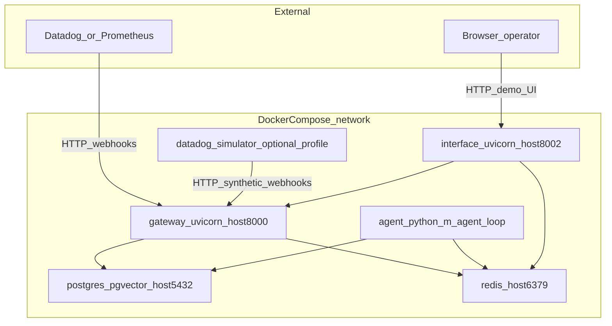
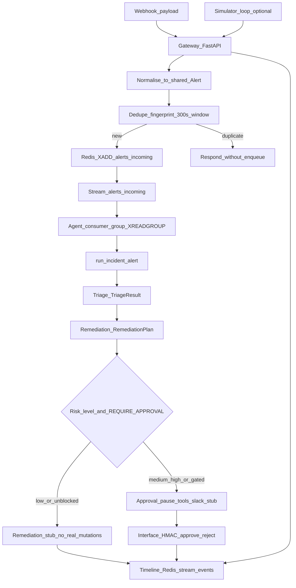
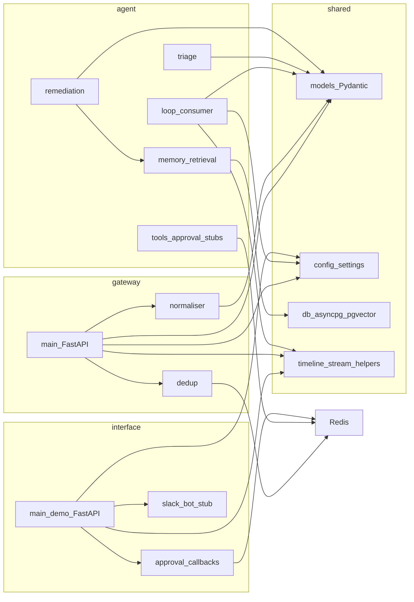

# Incident-Agent architecture

This document summarizes how the MVP is structured. For day-to-day agent context, see [CLAUDE.md](../CLAUDE.md) and the package-level `AGENTS.md` files under `gateway/`, `agent/`, `interface/`, and `shared/`.

## High-level shape

- **Stack**: Python 3.12, async-first, **FastAPI** for HTTP services, **structlog** for JSON logs, **Pydantic v2** contracts in `shared/`, configuration via **pydantic-settings** and environment variables.
- **Data path**: Webhook → **gateway** (normalize + dedupe) → **Redis Stream** `alerts:incoming` → **agent** (consumer group + `run_incident`) → triage / remediation / approval → timeline events (Redis-backed for the demo interface).
- **Persistence**: **Postgres + pgvector** in Docker Compose for runbook retrieval work; database helpers live in [shared/db.py](../shared/db.py).
- **Human loop**: [interface/main.py](../interface/main.py) exposes a demo FastAPI UI (port 8002 in Compose) with HMAC-signed approve/reject and timeline reads; Slack-oriented code is stubbed in [interface/slack_bot.py](../interface/slack_bot.py) and [interface/approval.py](../interface/approval.py).
- **Dev traffic**: Optional [simulator/datadog_simulator.py](../simulator/datadog_simulator.py) sends synthetic Datadog-style webhooks when the Compose **simulator** profile is enabled ([docker-compose.yml](../docker-compose.yml)).

## Architecture diagrams

### Deployment (Docker Compose)

Processes, ports (host), and primary dependencies. The simulator service is optional (`profiles: simulator`).

### Alert pipeline (end-to-end)

From webhook receipt through queueing, incident handling, and observability surfaced to the demo UI.

### Code packages and shared contracts

Python packages and how they lean on `shared` types and infrastructure.

## Runtime topology (Docker Compose)

From [docker-compose.yml](../docker-compose.yml):

| Service | Role | Port (host) |
|---------|------|----------------|
| `postgres` | pgvector/pg16 | 5432 |
| `redis` | streams + keys (dedupe, control, timeline) | 6379 |
| `gateway` | `uvicorn gateway.main:app` | 8000 |
| `agent` | `python -m agent.loop` (long-running consumer) | (none exposed) |
| `interface` | `uvicorn interface.main:app` | 8002 |
| `datadog-simulator` (profile) | loop sending webhooks to gateway | — |

Application containers mount the repo, install [requirements.txt](../requirements.txt) on start, and share `REDIS_URL` / `DATABASE_URL`.

## Package responsibilities

- **[gateway/](../gateway/)**: [gateway/main.py](../gateway/main.py); [normaliser.py](../gateway/normaliser.py) maps vendor payloads to [shared/models.py](../shared/models.py) `Alert`; [dedup.py](../gateway/dedup.py) enforces fingerprint + 300s window; enqueues to the Redis stream; timeline via [shared/timeline.py](../shared/timeline.py).
- **[agent/](../agent/)**: [agent/loop.py](../agent/loop.py) owns the Redis consumer group and `run_incident`; [triage.py](../agent/triage.py), [remediation.py](../agent/remediation.py), [tools.py](../agent/tools.py) for approval stubs; [memory.py](../agent/memory.py) for retrieval-oriented behavior.
- **[shared/](../shared/)**: Contracts (`models.py`), settings (`config.py`), Postgres (`db.py`), timeline (`timeline.py`), [debug_log.py](../shared/debug_log.py).
- **[interface/](../interface/)**: Demo HTTP API and approval helpers; Slack integration remains stub/placeholder.
- **[runbooks/](../runbooks/)**: Markdown seeds for future pgvector-backed context.

## MVP constraints

- **No LangChain/LangGraph** for MVP; LLM providers (Anthropic/OpenAI) are env-driven.
- **Remediation execution is stubbed**; medium/high risk and `REQUIRE_APPROVAL` paths pause for human approval (Slack stub / demo UI).
